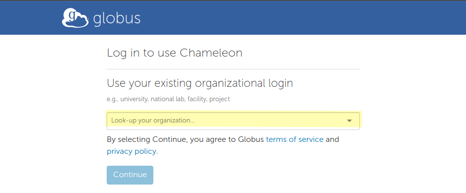
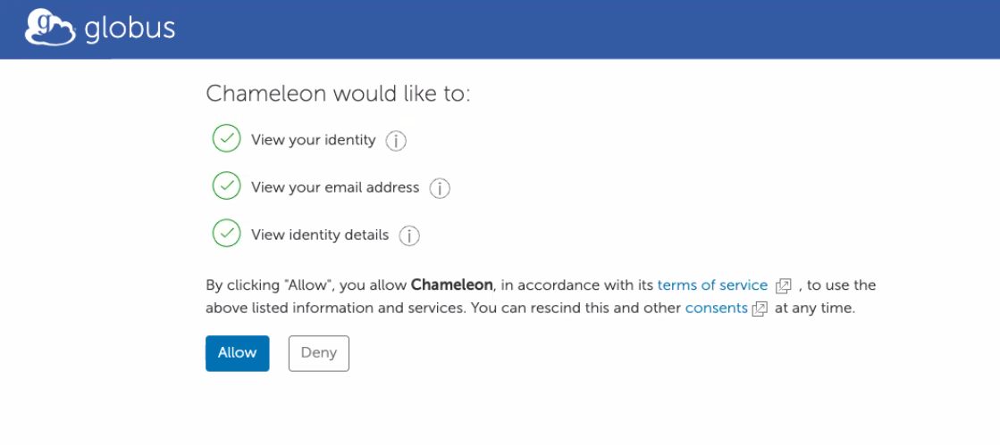
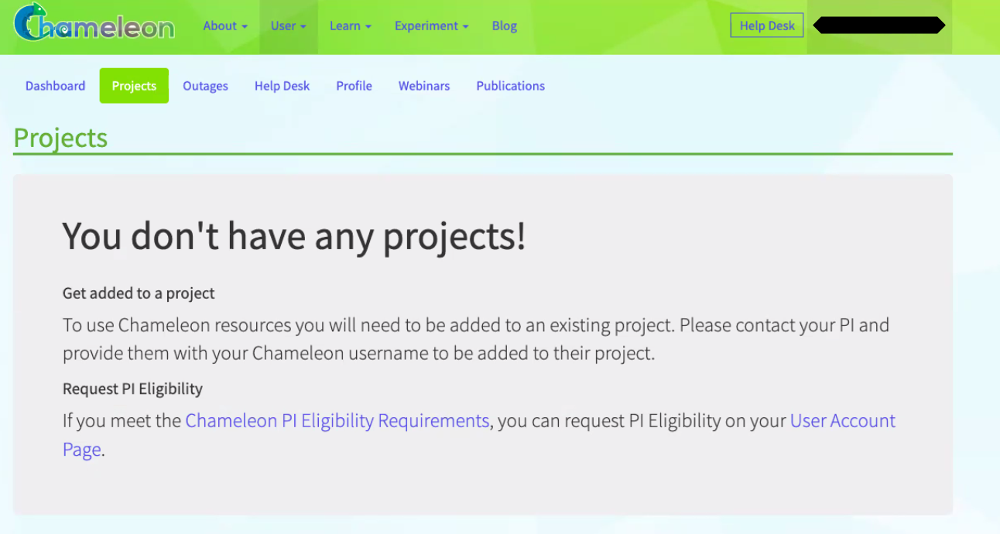
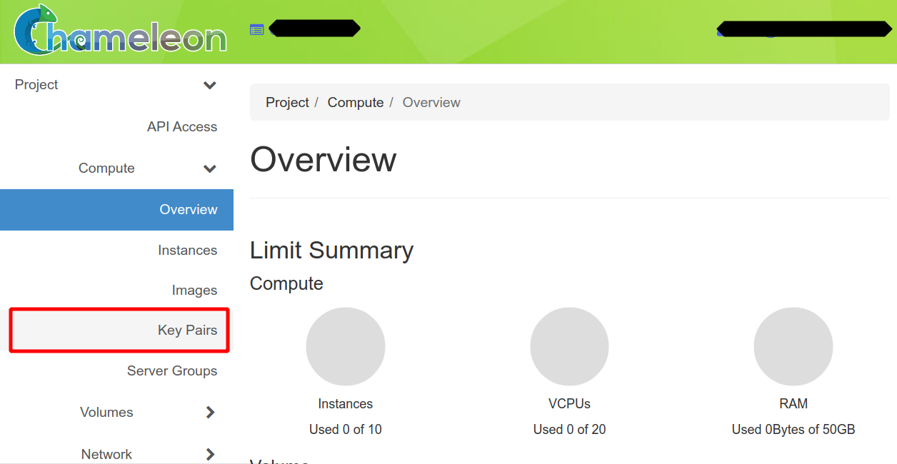
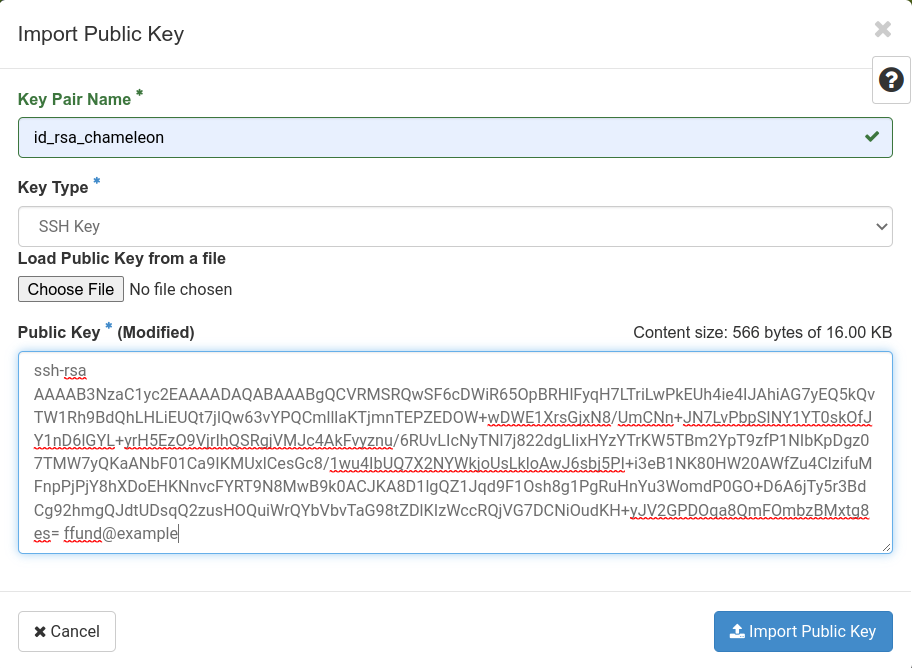

# Hello, Chameleon

In this tutorial, you will learn how to use Chameleon to run experiments in computer networks or cloud computing. It should take you about 60-90 minutes of *active* time to work through this tutorial.

> **Note** This process has a "human in the loop" approval stage - you'll need to wait for your instructor or research advisor to approve your request to join their project. Be prepared to start the tutorial, wait for this approval, and then continue.

Chameleon is a "virtual lab" for experiments on networking, cloud computing, and distributed systems. It allows experimenters to set up real (not simulated!) bare metal servers at Chameleon host sites located around the United States. Experimenters can then log in to the hosts associated with their experiment and install software, run applications, and collect measurements.

Before you can run lab experiments on Chameleon, you will need to set up an account. Once you have completed the steps on this page, you will have an account that you can use for future experiments.

## Prepare your workstation

You'll need to prepare your workstation (the laptop or PC you are going to use for your experiments) with a suitable terminal application.

### Terminal software

To use Chameleon, the primary software application you'll need is a terminal, which you will use to log in to remote hosts over SSH.

You may have a terminal application already on your workstation. If not, here are some suggestions:

-   [cmder](https://cmder.app/) for Windows. (Get the full version, not the mini version.)
-   [iTerm2](https://www.iterm2.com/) for Mac
-   [terminator](https://launchpad.net/terminator) for Linux

Once you have downloaded and installed your terminal application, make sure you know how to open it!

## Set up your account on Chameleon

Now that you have the software you need, you are ready to set up an account on Chameleon.

### Exercise: Create an account

> **Note** To complete this step, you'll need to know the **Project Name** of the project that you will join. Your instructor or research advisor will tell you the project name to use.

First, go to <https://chameleoncloud.org/> and click on "Log In".

Click on the link that says "Sign up now"


to get to the user registration page. Then, click "Sign in via federated login".

You will want your Chameleon account to be linked to your university credentials, so select your university from the list:



and then click Continue. Log in with your university credentials.

Click Continue at the next prompt:


Confirm that you will use Chameleon for non-profit research or educational purposes, and agree to the Globus terms:


Allow Chameleon to get your name and email address from your university login:



Then, read and accept the Chameleon terms of use and acceptable use policy. Also click OK to agree to acknowledge Chameleon in any publication supported by its use.

### Exercise: Join a project

At this stage, you have an account on Chameleon, but your account is not yet a part of any project. To use Chameleon, you need to be a part of a project that has been approved by the Chameleon staff, under the supervision of a project lead who supervises your use of Chameleon.

If you click on the "Projects" tab in the Chameleon dashboard, you'll see this:



Tell your instructor that you have created your Chameleon account, and let them know the email address associated with your Chameleon account. Once they have added you to their project, you'll see it listed on that page, and you can continue with the next step.

### Exercise: Create SSH keys

Once you are part of a project with an active allocation, you can set up SSH keys.

> Note: If you already have an SSH key pair, you can use it with Chameleon - copy the contents of the public key, then skip to the "Exercise: Upload SSH keys to Chameleon" section and continue there. If you don't already have an SSH key pair, continue with the rest of this section.

Chameleon users access resources using *public key authentication*. Using SSH public-key authentication to connect to a remote system is a more secure alternative to logging in with an account password.

SSH public-key authentication uses a pair of separate keys (i.e., a key pair): one "private" key, which you keep a secret, and the other "public". A key pair has a special property: any message that is encrypted with your private key can only be decrypted with your public key, and any message that is encrypted with your public key can only be decrypted with your private key.

This property can be exploited for authenticating login to a remote machine. First, you upload the public key to a special location on the remote machine. Then, when you want to log in to the machine:

1.  You use a special argument with your SSH command to let your SSH application know that you are going to use a key, and the location of your private key. If the private key is protected by a passphrase, you may be prompted to enter the passphrase (this is not a password for the remote machine, though).
2.  The machine you are logging in to will ask your SSH client to "prove" that it owns the (secret) private key that matches an authorized public key. To do this, the machine will send a random message to you.
3.  Your SSH client will encrypt the random message with the private key and send it back to the remote machine.
4.  The remote machine will decrypt the message with your public key. If the decrypted message matches the message it sent you, it has "proof" that you are in possession of the private key for that key pair, and will grant you access (without using an account password on the remote machine.)

(Of course, this relies on you keeping your private key a secret.)

We're going to generate a key pair on our laptop, then upload it to the Chameleon sites we are likely to use.

Open a terminal, and generate a key named `id_rsa_chameleon`:

    ssh-keygen -t rsa -f ~/.ssh/id_rsa_chameleon

Follow the prompts to generate and save the key pair. The output should look something like this:

    $ ssh-keygen -t rsa
    Generating public/private rsa key pair.
    Enter file in which to save the key (/users/ffund01/.ssh/id_rsa_chameleon): 
    Enter passphrase (empty for no passphrase): 
    Enter same passphrase again: 
    Your identification has been saved in /users/ffund01/.ssh/id_rsa_chameleon.
    Your public key has been saved in /users/ffund01/.ssh/id_rsa_chameleon.pub.
    The key fingerprint is:
    SHA256:z1W/psy05g1kyOTL37HzYimECvOtzYdtZcK+8jEGirA ffund01@example.com
    The key's randomart image is:
    +---[RSA 2048]----+
    |                 |
    |                 |
    |           .  .  |
    |          + .. . |
    |    .   S .*.o  .|
    |     oo. +ooB o .|
    |    E .+.ooB+* = |
    |        oo+.@+@.o|
    |        ..o==@ =+|
    +----[SHA256]-----+

If you use a passphrase, make a note of it somewhere safe! (You don't have to use a passphrase, though - feel free to leave that empty for no passphrase.)

Then, run

    cat ~/.ssh/id_rsa_chameleon.pub

to print the contents of the public key to your terminal. You will need this in the next step.

### Exercise: Upload SSH keys to Chameleon

Now, we will upload this key to several of the Chameleon sites we are most likely to use: KVM@TACC, CHI@TACC, and CHI@UC. (If you later run an experiment at a Chameleon site not on this list, you'll need to upload this key there, too.)

While logged on to the Chameleon user portal, click on Experiment \> KVM@TACC.

Click on the "Key Pairs" option in the Compute menu:



Then click on "Import Public Key".

Name your key, set the key type to "SSH key", and then paste the contents of your public key:



Then, click "Import Public Key" to save the key to your profile.

While logged on to the Chameleon user portal, click on Experiment \> CHI@TACC and repeat this step there.

Then, click on Experiment \> CHI@UC and repeat this step there, too.

### Exercise: Open this notebook in Jupyter

Once you are part of a Chameleon project, you can reserve resources on Chameleon and access them over SSH! We'll use Chameleon's Jupyter environment for this.

From the [Chameleon website](https://chameleoncloud.org/), click on "Experiment \> Jupyter Interface" in the menu. You may be prompted to log in again.

To continue working on this tutorial, you'll want to get the rest in "notebook" form.

In the Jupyter environment, select File \> New \> Terminal and in this terminal, run

    git clone https://github.com/teaching-on-testbeds/hello-chameleon

Then, in the file browser on the left side, open the `hello-chameleon` directory and then double-click on the `hello_chameleon.ipynb` notebook to open it.

If you are prompted about a choice of kernel, you can accept the Python3 kernel.

Then, you can continue this tutorial by executing the cells in the notebook directly in this Jupyter environment.

## Exercise: reserve resources

Whenever you run an experiment on Chameleon, you will

1.  Open a Python notebook, which includes commands to reserve and configure the resources (VMs, bare metal servers, or networks) that you need for your experiment. Run these commands.
2.  Wait until the resources in your experiment are ready to log in.
3.  Log in to the resources and run your experiment (either by executing commands in the notebook, or by using SSH in a terminal and running commands in those SSH sessions).

Also, when you finish an experiment and have saved all the data somewhere safe, you will *delete* the resources in your experiment to free them for use by other experimenters.

In this exercise, we will reserve a single virutal machine on Chameleon, and practice logging in to execute commands on this VM.

First, we will need to initialize the environment - tell it what Chameleon project to associate our experiment with.

You should already be a part of a Chameleon project, which has a project ID in the form "CHI-XXXXX". If you don't know your project ID, you can find it by logging in to the Chameleon web portal, and checking your [dashboard](https://chameleoncloud.org/user/dashboard/).

Once you find out *your* project ID, replace the "CHI-XXXXXX" in this next cell with your project ID. Then, run the cell.

``` python
import chi,os

project_id = "CHI-XXXXXX"
site_name = "KVM@TACC"
# tell python-chi what project to use, and where
chi.set("project_name", project_id)  
chi.use_site(site_name)
# also set environment variables, for benefit of future commands
os.environ["OS_PROJECT_NAME"] = project_id
os.environ["OS_REGION_NAME"] = site_name
```

Next, we'll give our resource a name. Every resource in a project should have a unique name, so we will include your username and a timestamp, as well as a description of the experiment, in the name.

``` python
import datetime
exp_name = "hello_chameleon"
exp_user = os.getenv("USER")
exp_start = datetime.datetime.now().strftime("%Y%_m_%d_%H_%M_%S")
server_name = f"{exp_name}-{exp_user}-{exp_start}"
```

Now we are ready to ask Chameleon to allocate a resource to us! For a VM, we specify the "flavor" or size of the resource (in terms of CPU, memory, and storage) and the operating system image that we want to have pre-installed.

``` python
import chi.server
flavor = "m1.small"
image_name = "CC-Ubuntu20.04"
server = chi.server.create_server(server_name, 
                                  key_name='id_rsa_chameleon',
                                  image_name=image_name, 
                                  flavor_name=flavor)

server_id = server.id
chi.server.wait_for_active(server_id)
```

Once the resource is allocated and ready, we will associate a network address to it, so that we can log in to the resource over the Internet using the SSH protocol.

``` python
reserved_fip = chi.server.associate_floating_ip(server_id)
reserved_fip
```

There's one more step before we can log in to the resource - by default, all connections to VM resources are blocked, as a security measure. We will need to add a "security group" that permits SSH connections to our project (if it does not already exist), then attach this security group to our VM resource.

``` python
%%bash
export OS_AUTH_URL=https://kvm.tacc.chameleoncloud.org:5000/v3

access_token=$(curl -s -H"authorization: token $JUPYTERHUB_API_TOKEN"     "$JUPYTERHUB_API_URL/users/$JUPYTERHUB_USER"     | jq -r .auth_state.access_token)
export OS_ACCESS_TOKEN="$access_token"
SECURITY_GROUP_NAME="Allow SSH"

if ! openstack security group show "$SECURITY_GROUP_NAME" > /dev/null 2>&1; then
    echo "Security group does not exist yet - creating it for you now"
    openstack security group create "$SECURITY_GROUP_NAME"  --description "Enable SSH traffic on TCP port 22"
    openstack security group rule create "$SECURITY_GROUP_NAME" \
     --protocol tcp --dst-port 22:22 --remote-ip 0.0.0.0/0

else
    echo "Security group already exists"
fi
```

``` python
nova_server = chi.nova().servers.get(server_id)
nova_server.add_security_group("Allow SSH")
f"updated security groups: {[group.name for group in nova_server.list_security_group()]}"
```

That's all we need to do to prepare a resource to log in! Run the following cell - when it returns, it means that the VM resource is ready for you to log in.

``` python
chi.server.wait_for_tcp(reserved_fip, port=22)
```

## Exercise: log in to resources and execute commands

In this exercise, we'll practice running commands on the VM resource by opening an SSH session in a local terminal and running commands in that session.

### Log in over SSH from local terminal

To log in to the VM over SSH, you will:

-   open your terminal application,
-   run the cell below, which will print an SSH login command,
-   copy this command and make any necessary modifications (if needed, as described in the following cell),
-   paste it into your terminal and hit Enter.

``` python

print(f"ssh -i ~/.ssh/id_rsa_chameleon cc@{reserved_fip}")
```

If your Chameleon key is in a different location, or has a different name, then you may need to modify the `~/.ssh/id_rsa_chameleon` part of this command to point to *your* key.

The first time you log in to each new host, your computer may display a warning similar to the following:

``` shell
The authenticity of host "129.114.26.xx (129.114.26.xx)" cannot be established.
ED25519 key fingerprint is SHA256:1fcbGrgLDdOeorauhz3CTyhmFqOHsrEWlu0TZ6yGoDM.
This key is not known by any other names
Are you sure you want to continue connecting (yes/no/[fingerprint])?
```

and you will have to type the word *yes* and hit Enter to continue.

If you have specified your key path and other details correctly, it won't ask you for a password when you log in to the node. (It may ask for the passphrase for your private key if you've set one.)

The output of the above command will look somewhat like this.

``` shell
Welcome to Ubuntu 20.04.4 LTS (GNU/Linux 5.4.0-124-generic x86_64)

 * Documentation:  https://help.ubuntu.com
 * Management:     https://landscape.canonical.com
 * Support:        https://ubuntu.com/advantage

 System information disabled due to load higher than 1.0


0 updates can be applied immediately.


The list of available updates is more than a week old.
To check for new updates run: sudo apt update

Last login: Thu Mar  2 18:21:51 2023
To run a command as administrator (user "root"), use "sudo <command>".
See "man sudo_root" for details.

cc@hello-chameleon-XXXXX-2023-3-02-18-18-49:~$ 
```

Let's practice running a command in this remote session. Copy and paste the following command into the SSH terminal, to create a file and populate it with a "hello" message:

``` shell
echo "Hello from $(hostname)" > hello.txt
```

then check the file contents:

``` shell
cat hello.txt
```

Now we will use this file "hello.txt" in a later exercise, when we want to practice transferring files between the remote host and our own laptop!

## Exercise: transfer files to and from resources

While working on a remote host, we will often want to transfer files from the remote host to our local filesystem, or vice versa.

To move data back and forth between your laptop and a remote system that you access with *ssh*, we can use *scp*. The syntax is:

``` shell
scp [OPTIONS] SOURCE DESTINATION
```

where `SOURCE` is the full address of the location where the file is currently llocated, and `DESTINATION` is the address of the location that you want to copy a file to.

### Transfering files through the local terminal

We previously generated a file on the remote VM, "hello.txt". Now, we'll use `scp` to transfer the file from the remote host to our laptop, make a change to it, then transfer it back.

You will run the `scp` command from your *local* terminal, not on the remote host. If you are still logged in over SSH to the remote host, type

``` shell
exit
```

to return to your local terminal. Check the terminal *prompt* and make sure it reflects that you are executing commands at your local terminal, and not on the Chameleon VM.

Then, we'll need to generate an `scp` command to run, including:

-   the location of the key you use to SSH into the remote host, e.g. `~/.ssh/id_rsa_chameleon`
-   the username you use to SSH into the remote host, `cc` in this case
-   the IP address or hostname you use to SSH into the remote host
-   the location of the file you want to copy on the remote host, which is `/home/cc/hello.txt`
-   and the location on your laptop to which you want to copy the file. We will copy it to the same location from which you run the scp command (`.` is shorthand for "my current working directory"),

Run the cell below, to generate the `scp` command:

``` python
print(f'scp -i ~/.ssh/id_rsa_chameleon cc@{reserved_fip}:/home/cc/hello.txt .')
```

Copy the command that is printed by the cell above, and make any changes if necessary (e.g. to the key location or name, or to the location in your local filesystem to which the file should be transferred). Then, execute it in your *local* shell. (Note that the `.` at the end is part of the command - don't omit this part!)

The output of this command should show that the file is transferred to your local filesystem:

``` text
hello.txt                       100%    1KB     0.1KB/s   00:00
```

When you have successfully transferred "hello.txt" from the remote host to your laptop, locate it in your local filesystem and open it in your preferred text editor. Make a change (any change!) to the file and save it.

Then, we'll transfer it back to the remote host! To transfer it back to the remote host, the `SOURCE` argument will become the location of the file in the local filesystem, and the `DESTINATION` will become the location to which the file should be transferred on the remote VM.

Use the cell below to generate the `scp` command to transfer the file *to* the remote host:

``` python
print(f'scp -i ~/.ssh/id_rsa_chameleon hello.txt cc@{reserved_fip}:/home/cc/')
```

Copy the command that is printed by the cell above, and make any changes (e.g. to the key location or name, or to the location in your local filesystem from which the file should be transferred). Then, execute the command in your *local* shell.

The output of this command should show that the file is transferred to the remote filesystem:

``` text
hello.txt                       100%    1KB     0.1KB/s   00:00
```

To validate that the changes you made locally are now reflected in the version of the file that is on the remote host, use the SSH command from the previous section to log in to the remote host again, and run

``` shell
cat hello.txt
```

in the SSH session. Verify that your changes appear in the output.

## Exercise: delete resources

Chameleon is a shared facility, and it is important to be mindful of your resource usage and to "free" resources for use by other experimenters when you are finished with them.

In the cell below, change `False` to `True`, then run the cell to free the VM and the network address you attached to it.

Note that removing the resources will revoke your access to them, and all the information stored on them will be erased. Therefore, ensure that you have saved all your work before deleting the resources.

``` python
DELETE = False

if DELETE:
    chi.server.delete_server(server_id)
    ip_details = chi.network.get_floating_ip(reserved_fip)
    chi.neutron().delete_floatingip(ip_details["id"])
```
<hr>

<small>Questions about this material? Contact Fraida Fund</small>

<hr>

<small>This material is based upon work supported by the National Science Foundation under Grant No. 2231984 and Grant No. 2230079.</small>
<small>Any opinions, findings, and conclusions or recommendations expressed in this material are those of the author(s) and do not necessarily reflect the views of the National Science Foundation.</small>


